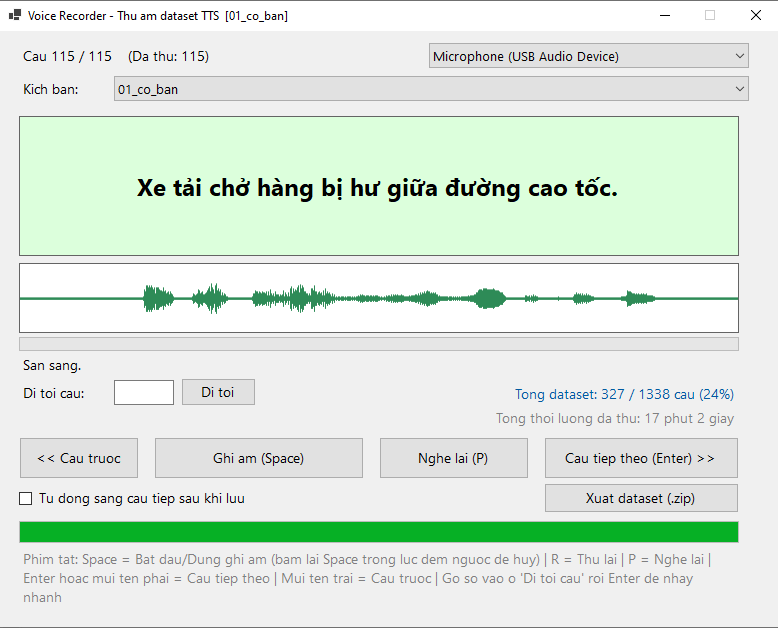

# VoiceRecorder
<p align="center">
  
</p>

Tool thu âm dataset để train TTS (Piper) bằng chính giọng của bạn.
VB.NET, .NET 9, WinForms, dùng NAudio để ghi âm và convert audio.

## Cách build

Yêu cầu: đã cài **.NET 9 SDK** (không cần Visual Studio).

```
build.bat
```

File chạy sẽ nằm ở: `bin\Release\net9.0-windows\VoiceRecorder.exe`

Lần build đầu tiên cần internet để NuGet tải gói `NAudio`.

## Cách dùng

1. Mở `VoiceRecorder.exe`.
2. Chọn microphone ở góc trên bên phải (nếu có nhiều thiết bị).
3. Chọn **"Kịch bản"** (bộ câu mẫu) muốn thu ở ô ngay dưới — có sẵn nhiều bộ trong thư mục `scripts\` (câu cơ bản, câu hỏi/cảm thán, số/ngày tháng, hội thoại ngắn). Có thể tự thêm bộ câu khác bằng cách thả file `.txt` mới (mỗi dòng 1 câu) vào thư mục này.
4. Đọc câu hiển thị giữa màn hình, bấm **Space** để bắt đầu ghi, bấm **Space** lần nữa để dừng.
5. File `.wav` sẽ tự lưu vào `dataset\<tên kịch bản>\wavs\`, và dòng text tương ứng tự ghi vào `dataset\<tên kịch bản>\metadata.csv`.
6. App tự kiểm tra chất lượng bản ghi (quá ngắn, quá nhỏ/im lặng, vỡ tiếng) — nếu không đạt sẽ báo lỗi và **không lưu**, giữ nguyên bản ghi tốt trước đó (nếu có).
7. Bấm **P** để nghe lại câu vừa thu. Nếu đọc sai/vấp, bấm **R** để thu lại (ghi đè lên câu cũ).
8. Bấm **Enter** hoặc mũi tên phải để sang câu tiếp theo. Mũi tên trái để quay lại câu trước.
9. Có thể tắt app giữa chừng, mở lại sẽ tự nhảy về đúng câu đang làm dở của kịch bản đang chọn (tiến độ được lưu riêng cho từng kịch bản).

## Format output (chuẩn Piper)

Mỗi kịch bản (bộ câu) có một thư mục dữ liệu riêng:

- `dataset\<tên kịch bản>\wavs\0001.wav`, `0002.wav`, ... — mono, 16-bit, 22050Hz.
- `dataset\<tên kịch bản>\metadata.csv` — mỗi dòng dạng `id|text`, ví dụ:
  ```
  0001|Xin chào, hôm nay trời rất đẹp.
  0002|Tôi đang học cách lập trình bằng ngôn ngữ Visual Basic.
  ```

Khi train, notebook sẽ tự gộp tất cả các kịch bản lại thành 1 dataset duy nhất (đánh số lại cho khỏi trùng) — bạn chỉ cần nén nguyên thư mục `dataset` là đủ, không cần tự gộp tay.

## Tùy chỉnh câu mẫu

Thêm/sửa file `.txt` trong thư mục `scripts\` (mỗi dòng 1 câu, tên file = tên kịch bản hiện trong app). Đã có sẵn vài bộ để bắt đầu — nên bổ sung thêm nếu muốn dataset lớn hơn (khuyến nghị tối thiểu 30 phút audio tổng cộng, càng nhiều càng tốt).

## Lưu ý thu âm

- Phòng yên tĩnh, hạn chế tiếng vang/echo.
- Giữ khoảng cách mic ổn định, tốc độ đọc tự nhiên, không quá nhanh.
- Theo dõi thanh volume meter: tránh để mức quá thấp (giọng nhỏ) hoặc kịch kim liên tục (dễ vỡ tiếng/clip).
- Nếu thu nhiều buổi/nhiều ngày, cố giữ **âm lượng và khoảng cách mic đều nhau** giữa các buổi để dataset đồng nhất.
- Mệt hoặc khàn giọng giữa chừng thì nên nghỉ, thu tiếp lúc khác — giọng gằn vì mệt sẽ ảnh hưởng chất lượng model.
- Không cần đợi thu hết mới train thử: thu khoảng 100–150 câu đầu có thể train thử ngay để phát hiện sớm vấn đề (mic rè, sai format...), tránh tốn công thu hết cả trăm câu rồi mới phát hiện lỗi. Xem thêm mục "Train theo nhiều đợt" bên dưới.

## Bước tiếp theo: train giọng thành file `.onnx`

File `.onnx` + `.onnx.json` cuối cùng chính là "giọng nói" mà app .NET (bước sau, dùng Piper để phát) sẽ load để đọc bằng giọng bạn. Notebook huấn luyện (`Train_Piper_FineTune.ipynb`, đi kèm project này) fine-tune từ checkpoint tiếng Việt có sẵn `vi_VN-vais1000-medium`, dùng bộ code huấn luyện gốc của `rhasspy/piper` (đã vá lại vài chỗ để chạy được trên môi trường Python 3.12 hiện nay).

Có thể chạy notebook này trên **Google Colab**, **Kaggle** (nếu Colab đòi nâng cấp trả phí để dùng GPU), hoặc **máy tính có card đồ hoạ NVIDIA riêng**. Chọn 1 trong 3 cách dưới đây.

### Cách 1: Google Colab (miễn phí, nhưng có giới hạn giờ dùng GPU/ngày)

1. **Nén dataset:** nén thư mục `dataset` (chứa các thư mục con `<tên kịch bản>\wavs\` + `metadata.csv`) thành file `dataset.zip`.
2. **Upload lên Google Drive:** đưa `dataset.zip` lên Drive, tốt nhất để ngay trong `MyDrive` gốc (nếu để trong thư mục con thì nhớ sửa đường dẫn `DATASET_ZIP` ở Bước 0 trong notebook).
   - Nếu Drive không kết nối được (hay gặp trên điện thoại): mở Bước 0 trong notebook, tắt công tắc `USE_DRIVE` — notebook sẽ chuyển sang upload `dataset.zip` trực tiếp từ máy/điện thoại, không cần Drive.
3. **Mở Google Colab:** truy cập [colab.research.google.com](https://colab.research.google.com/) → **"Tải sổ tay lên"** → tab **"Tải lên"** → chọn file `Train_Piper_FineTune.ipynb` từ máy (không cần đưa file này lên Drive trước, chỉ `dataset.zip` mới cần).
4. **Bật GPU:** vào **Runtime → Change runtime type → GPU (T4)** trước khi chạy.
5. **Chạy lần lượt từng ô từ trên xuống** (hoặc **Runtime → Run all**) — không nhảy cóc. Mỗi lần mở notebook mới/restart runtime, phải chạy lại từ ô đầu tiên (Bước 0), vì mọi thứ của phiên cũ đều mất.

Notebook sẽ tự: kết nối dữ liệu → gộp các kịch bản thành 1 dataset → cài môi trường (đã vá sẵn các lỗi phiên bản cũ hay gặp) → tải checkpoint `vais1000-medium` → fine-tune (tự resume nếu bị ngắt giữa chừng, xem mục bên dưới) → export `.onnx` + nghe thử → lưu kết quả vào Drive.

### Cách 2: Kaggle Notebooks (miễn phí, không đòi nâng cấp trả phí)

Nếu Colab báo hết quota GPU miễn phí hoặc đòi mua Colab Pro, dùng Kaggle thay thế — **30 giờ GPU T4/tuần miễn phí**, chỉ cần xác minh số điện thoại 1 lần, không cần thẻ tín dụng:

1. Vào [kaggle.com](https://www.kaggle.com) → đăng nhập → **Create → New Notebook**.
2. Góc phải màn hình, mở phần **Settings**: bật **Accelerator → GPU T4 x2**, và bật **Internet → On** (mặc định đang tắt — phải bật tay thì mới `pip install`/tải checkpoint được).
3. Upload `dataset.zip` qua tab **"Add Input"** (bên phải) → **Upload → New Dataset** — Kaggle sẽ đặt nó ở đường dẫn `/kaggle/input/<tên-dataset>/dataset.zip`.
4. Mở `Train_Piper_FineTune.ipynb`, copy nội dung từng ô sang notebook Kaggle (Kaggle không có nút "tải sổ tay lên" trực tiếp như Colab, nhưng copy/paste từng ô là được).
5. Sửa 2 chỗ khác biệt so với Colab:
   - Bỏ qua đoạn `drive.mount(...)` — Kaggle không dùng Google Drive. Đặt thẳng `DATASET_ZIP = "/kaggle/input/<tên-dataset>/dataset.zip"`.
   - Đặt `TRAIN_ROOT = "/kaggle/working/piper_training"` thay vì đường dẫn Drive — kết quả (checkpoint, file `.onnx` cuối) sẽ nằm trong tab **Output** ở cuối phiên, tải về máy từ đó.
6. Lưu ý: dữ liệu trong `/kaggle/working` **chỉ tồn tại trong phiên hiện tại** — nếu cần train nhiều đợt (xem mục bên dưới), phải tự tải checkpoint về máy sau mỗi phiên rồi upload lại làm Input cho phiên sau (không tự resume được dễ dàng như bên Colab+Drive).

### Cách 3: Chạy trên máy tính có card đồ hoạ NVIDIA riêng

Nhanh và tiện nhất nếu máy bạn có GPU rời (khuyến nghị tối thiểu 6GB VRAM) — không giới hạn giờ, không cần mạng ổn định, không cần vá lỗi phiên bản như trên Colab:

1. Cài **Python 3.10 hoặc 3.11** (khuyên dùng bản này thay vì 3.12 — tránh phải vá các lỗi tương thích Cython/piper-phonemize như trên Colab) + driver NVIDIA + CUDA Toolkit tương ứng.
2. Cài `espeak-ng` (Windows: tải installer từ trang GitHub `espeak-ng/espeak-ng`).
3. Clone và cài piper:
   ```
   git clone https://github.com/rhasspy/piper.git
   cd piper/src/python
   pip install -e .
   pip install piper-phonemize==1.1.0
   bash build_monotonic_align.sh
   ```
   (Với Python 3.10/3.11, `piper-phonemize` gốc cài thẳng được, không cần bản thay thế `piper-phonemize-fix` như trên Colab.)
4. Chạy các lệnh `preprocess` / train / `export_onnx` giống hệt nội dung các ô lệnh trong `Train_Piper_FineTune.ipynb`, thay `!` đầu dòng bằng chạy trực tiếp trong terminal, và bỏ các phần liên quan tới Google Drive / vá requirements.txt (không cần trên máy local vì bạn tự kiểm soát phiên bản Python/CUDA).

## Train theo nhiều đợt (thu thêm dữ liệu rồi train tiếp)

Không cần thu hết một lần — thu một phần, train thử, quay lại thu thêm rồi train tiếp:

1. Thu một phần câu (ví dụ 100-150 câu đầu).
2. Nén `dataset` → `dataset.zip`, train đợt 1 theo 1 trong 3 cách ở trên.
3. Thu thêm câu (bộ cũ hoặc bộ mới đều được).
4. Nén lại **toàn bộ** thư mục `dataset` đè lên `dataset.zip` cũ.
5. Chạy lại notebook, **giữ nguyên tên giọng (`VOICE_NAME`) và nơi lưu tiến độ** như đợt trước — notebook tự nhận ra checkpoint đã train từ đợt trước và train tiếp, không mất tiến độ cũ.

Cách này hoạt động ổn định nhất với **Colab + Google Drive** (`USE_DRIVE = True`). Với Kaggle, phải tự tải/upload lại checkpoint giữa các phiên như ghi chú ở Cách 2.
